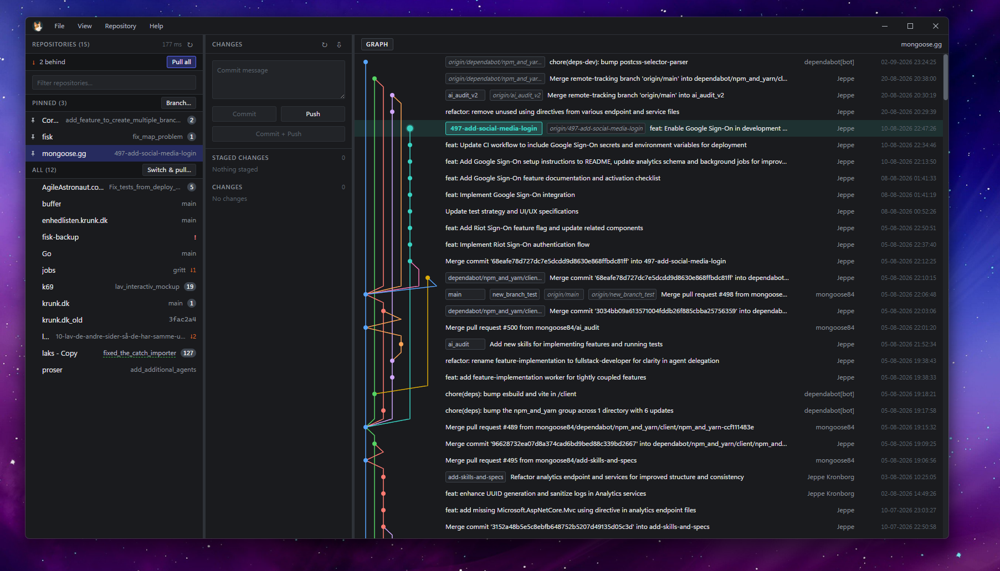

<p align="center">
  
</p>

# Corgit

**Meet Corgit — your git herding dog.** Point it at the folder where all your repositories
live and it watches every one of them, so you can see at a glance which ones need you. No
more `cd`-ing through a dozen directories running `git status` to work out what you forgot
to push on Friday.

If your day looks like *"I have 70 repos checked out, about five are active, and I keep
losing track"* — that is the dog's entire job.



## What you get

- **Every repo on one screen.** Each row carries its branch, a count of changed files and
  an ahead/behind badge. Pin the ones you are living in to the top.
- **Four verbs, no ceremony.** Fetch, pull, commit, push — plus staging, branch switching,
  and the short list that keeps you from having to leave: create or delete a branch, merge
  one from the graph, discard changes, and `.gitignore` or delete an untracked file from the
  context menu. No hunk staging, no rebase, no conflict resolution. Corgit is a dashboard
  over many repositories, not a general git client, and it does not try to be one.
- **One click for the whole root.** *Fetch all* and *Pull all behind* run across every repo
  at once, narrated by a progress strip with a *Stop* that means it. The pinned set takes a
  new branch in one go; the *All* section can switch to a branch and pull it in every repo
  that has one. Whatever failed lands in a single banner that will filter the list down to
  exactly those repos.
- **Your working tree, live.** Staged and unstaged files for the selected repo — arrow keys
  to move, a modifier click to act on a set — with a side-by-side diff of whichever file you
  last clicked behind the other tab.
- **A graph you can read.** Uncommitted changes on top, the HEAD commit marked with a larger
  dot and a tint of its own lane colour, ref badges where they belong.
- **It keeps up with your terminal.** Every repo gets a filesystem watcher, so a commit you
  make outside Corgit shows up without you asking for a refresh.
- **Errors in plain language.** A rejected push says it was rejected and offers the one
  action that resolves it — with the raw git stderr one click away, because you are a
  developer and you will want it.
- **Nothing happens silently.** A repo with a write running says so on its row, and every
  failure that was shown to you stays in *Help ▸ Recent Problems* — including the ones you
  dismissed, the ones you told it not to warn about again, and the ones that happened in a
  background sweep while you were looking elsewhere.
- **Your git, not a reimplementation.** Corgit shells out to the git you already have, so
  your credential helpers, hooks and LFS keep working exactly as they do in the terminal.

Windows-only for v1. The full design lives in **[docs/SPEC.md](docs/SPEC.md)**.

**Status: build step 9 of 10, plus what came after it.** Everything through branch switching
and conflict detection works; the polish pass has landed (pins, filter, per-repo watchers,
context menus, error translation, the combined title bar and menu, Recent Problems), and so
have the read-only diff viewer (§5.4) and the four multi-repo bulk runs (§5.1). What remains
is step 10, shipping with auto-update, and multi-window.

## Fast is the feature

The performance budget is the reason this project exists, and the numbers below are
checked-in tests rather than claims — [Measuring](#measuring) reproduces them on your
machine.

| | |
| --- | --- |
| Discovery, 69 repos | **5.6 ms** |
| Full status sweep, best observed | **1.2 s** |
| Full sweeps per minute, steady state | **0** |
| Budget (SPEC §1) | 300 ms |

The last two rows are the interesting ones. Reading 69 repositories cannot fit in 300 ms on
this machine, because the cost is not git — it is Windows creating processes. A bare
`git version`, which opens no repository at all, costs **85.7 ms** here, while a real
`git status --porcelain=v2` averages **71.8 ms**, putting git's own work at **2–10 ms for 66
of the 69 repos**. The only way to hit the budget is therefore to *not spawn*, which is why
every repo gets its own filesystem watcher and the periodic sweep is demoted to a
reconciliation pass. In steady state Corgit runs no sweeps at all.

The measurements behind that, including the two that rule out the obvious fixes, are in
[Under the hood](#under-the-hood).

---

## Prerequisites

| | Install |
| --- | --- |
| Node 22+ | — |
| Git 2.37+ | — |
| WebView2 runtime | — |
| Rust (stable, `x86_64-pc-windows-msvc`) | `winget install Rustlang.Rustup` |
| MSVC C++ build tools | `winget install Microsoft.VisualStudio.BuildTools --override "--quiet --wait --norestart --add Microsoft.VisualStudio.Workload.VCTools --includeRecommended"` |

Rust's default Windows toolchain links with MSVC, which is why the C++ build tools are
required even though no C++ is written here. Installing the standalone Build Tools leaves
any existing Visual Studio install untouched; adding the **Desktop development with C++**
workload to Visual Studio instead works equally well.

## Running

```sh
npm install
npm run tauri:dev      # the real app — needs Rust
```

The frontend also runs standalone in a browser, which is useful for layout work and needs
no Rust at all:

```sh
npm run dev            # http://localhost:1420
```

Outside Tauri, settings fall back to `localStorage` instead of the Rust backend, so pane
widths still persist. There is no git there, so the welcome screen says so rather than
showing an empty repo list.

Want a folder to try Corgit against without pointing it at your real work?
`bash scripts/make-demo-root.sh` builds a throwaway root — ahead, behind, dirty, a feature
branch, and one repo with no upstream. The screenshot above is taken against it, so it can
be reproduced whenever the UI moves.

## Building

```sh
npm run tauri:build
```

Produces a release build at `src-tauri/target/release/corgit.exe` — pin that to the
taskbar, not the `npm run dev` browser tab, which has no Rust backend and only shows the
welcome screen. Also produces an NSIS installer at
`src-tauri/target/release/bundle/nsis/Corgit_<version>_x64-setup.exe`, for a proper
Start Menu install instead of a loose exe.

## Checks

```sh
npm run check          # svelte-check + TypeScript
npm test               # vitest
npm run build          # check, then production bundle
cargo test --manifest-path src-tauri/Cargo.toml
cargo clippy --manifest-path src-tauri/Cargo.toml --all-targets -- -D warnings
```

These are exactly the two required CI checks: **Frontend** on Linux, **Backend** on Windows
with clippy warnings denied. Windows because that is what v1 ships and what the code is
written against. `cargo fmt` is deliberately not among them — the Rust is hand-formatted and
the reasoning is recorded in `.github/workflows/ci.yml`.

## Measuring

The §1 performance budget is the reason this project exists, so the measurements are
checked-in `#[ignore]`d tests rather than something to improvise later. Run them
`--release` — a debug build's numbers mean nothing.

```powershell
cd src-tauri
$env:CORGIT_BENCH_ROOT = 'C:\dev\code'
cargo test --release --lib -- --ignored --nocapture bench_status_sweep
cargo test --release --lib -- --ignored --nocapture bench_spawn_concurrency
```

`bench_status_sweep` times discovery and the full sweep over a real folder.
`bench_spawn_concurrency` times `git --version` at increasing concurrency; it does no
repository work, so it separates "this machine creates processes slowly" from "Corgit
creates them one at a time".

## Layout

```
src/
  app.css                    token layer — every colour lives here (SPEC §11)
  App.svelte                 pane grid, drag geometry, minimum widths
  lib/
    settings.svelte.ts       settings mirror; Tauri IPC or localStorage
    repos.svelte.ts          repo/status mirror; fed by the sweep event
    graph.svelte.ts          loaded commits, refs, graph selection
    graphLayout.ts           lane assignment — in-house, never `log --graph`
    diff.svelte.ts           the open file's diff; reconciled as the tree changes (§5.4)
    diffLayout.ts            unified hunks → two aligned columns, the graphLayout of §5.4
    fileSelection.ts         multi-select — what a modifier click does to a set (§5.2)
    ignorePatterns.ts        a file row → a `.gitignore` line; paths are not patterns
    repoFilter.ts            the filter box: substring on name, comma-separated for several
    switchTargets.ts         what Switch & pull does to each repo, decided before it runs
    branchName.ts            branch-name checking while you type (SPEC §8.3)
    busyIndicator.ts         when a spinner may be drawn — reveal delay, minimum hold
    gitErrors.ts             stderr → plain language (SPEC §13)
    dateFormat.ts            fixed dd-MM-yyyy HH:mm:ss, never a locale format
    notices.svelte.ts        the error banner's state — §13's middle tier
    problems.svelte.ts       Recent Problems, mirroring problems.rs
    multiBranch.svelte.ts    is the multi-repo Create Branch dialog open (two doors to it)
    switchPull.svelte.ts     the same three lines for Switch & pull
    menuModel.ts             the menu bar's contents as data (SPEC §4.1)
    menu.svelte.ts           menu model from live state; routes a chosen item
    windowFrame.svelte.ts    is the window maximized? (undecorated, so we ask)
    tauri.ts                 are we running inside the desktop shell?
    Welcome.svelte           first run, missing root, or missing git
    TitleBar.svelte          the one top row — mark, menus, caption buttons
    MenuBar.svelte           File · View · Repository · Help, and their opening
    MenuDropdown.svelte      one open menu's panel; checks, submenus, shortcuts
    WindowControls.svelte    minimize · maximize/restore · close
    Divider.svelte           draggable pane separator
    ContextMenu.svelte       right-click menus
    Popover.svelte           anchored overlay, used by row error badges
    NoticeBanner.svelte      a failure plus the one action that resolves it (SPEC §13)
    RecentProblems.svelte    Help ▸ Recent Problems… — what §13 lets the UI throw away
    CreateBranchDialog.svelte    new branch here, from a ref badge or a commit row
    DeleteBranchDialog.svelte    delete a local branch, from its ref badge
    MultiBranchDialog.svelte     one branch name, cut across the pinned set (§5.1)
    SwitchPullDialog.svelte      one existing branch, checked out across All and pulled
    PullAfterSwitchDialog.svelte you landed on a branch that is behind — pull it?
    DiscardDialog.svelte     the two acts in the pane that destroy work (§5.2)
    AbortMergeDialog.svelte  abort a conflicted merge; same category, same modal
    Glyph.svelte             a drawn + − × — the font's are on the math axis, not centred
    EmptyState.svelte
    Mascot.svelte            the dog — one pose per state (docs/mascot.md)
    mascot/                  the poses the app imports, cut from the sheet
    panes/
      Pane.svelte            shared header + scrolling body
      RepoList.svelte        left    — filter, bulk strip, pinned/all bands, sweep timing
      RepoRow.svelte         pin · name · branch · changed files · ahead/behind · busy
      CommitPane.svelte      middle  — message, staging, the four verbs, file context menu
      FileRow.svelte         status letter · path · stage/unstage on hover
      GraphPane.svelte       right   — virtualization, branch switching
      GraphRow.svelte        lanes · hash · subject · refs · author · date
      CommitInfoPanel.svelte commit details for the selected commit
      DiffView.svelte        right pane's second view — read-only, always (SPEC §5.4)
src-tauri/
  src/
    main.rs                  desktop entry point
    lib.rs                   app state, Tauri commands, the sweeps, the bulk runs
    settings.rs              versioned, atomically-written global settings
    roots.rs                 per-root pins and last selection
    atomicfile.rs            the one way a JSON file is written — temp, fsync, rename (§9.5)
    cache.rs                 per-root status cache — a cache, never truth
    git.rs                   git resolution + the global 8-process semaphore
    writequeue.rs            one write queue per repo (SPEC §7)
    inflight.rs              which repos have a write running — display only, never §7
    discovery.rs             depth-1 scan of a root
    status.rs                porcelain=v2 parser
    commit.rs                staging and commit
    ignore.rs                appending to `.gitignore` — the one write that is not git
    remote.rs                fetch, pull, push, publish
    branch.rs                switching, creating, deleting, merging (SPEC §8.3)
    graph.rs                 `git log` paging and the ref badges
    diff.rs                  one file's diff, parsed; read path only (SPEC §8.8)
    watch.rs                 one FS watcher per repo, tree included
    problems.rs              the Recent Problems ring (SPEC §13)
    menu.rs                  the native Windows menu bar
scripts/
  extract-mascot.py          contact sheet → poses, app assets, icon source
  make-demo-root.sh          throwaway repos to screenshot against
```

## Under the hood

- **Pane widths are stored as fractions**, not pixels, so they survive window resizing.
  Minimum widths win over the stored fraction when the window is too narrow; the middle
  pane yields first, then the left.
- **Rust owns application state.** The frontend is a view. This is what keeps multi-window
  safe later — per-repo write queues and the global git semaphore are process-wide, so
  Corgit runs as one process with many windows rather than many processes (SPEC §9.2).
- **Settings are advisory.** A corrupt or unreadable file resets to defaults and logs a
  warning; it never blocks startup.
- **Discovery is depth 1.** Direct children of the root only — one directory read plus an
  `exists()` per child, so it needs no progress UI (SPEC §8.1). The root itself counts too,
  so opening a single repository shows that repository rather than nothing.
- **Every repo is watched, working tree included.** One recursive watcher per repo covers
  the tree and `.git` together: on Windows a subtree watch is a single handle no matter how
  deep the tree goes, so all 69 cost 17 ms to establish, 73 handles and 4.4 MB. SPEC §6 used
  to say never watch the working tree, and that rule was reasoned about inotify — where a
  recursive watch really does cost a descriptor per directory — so it now applies to the
  Linux build (§10) and not to this one.
- **The status sweep is a reconciliation pass, not the refresh mechanism.** Most 60 s ticks
  cover only the repos no watcher would take (a network share, a linked worktree), which is
  usually none of them and costs nothing; every fifth tick is a full pass. Pinning is
  therefore about where a repo sits in the list, not how fast it updates — it still costs one
  click on the row, because it earned that as navigation for 77 rows (SPEC §5.1, §6).
- **First paint never waits on git.** `open_root` returns the discovered list immediately
  and the status sweep fills the rows in afterwards, over one batched event.
- **Concurrency is capped globally at 8 git processes**, by a static semaphore in `git.rs`
  rather than by app state — the cap has to hold across every window (SPEC §7.3).
- **A bulk run takes at most 4 of those 8** (SPEC §7.4). Headroom rather than a priority
  queue: *Fetch all*, *Pull all behind* and *Switch & pull* can each run for a long time over
  a large root, and whatever you click while one is running must not be stuck behind a queue
  whose end you cannot see. The fetch sweep already picked 4 for the same reason.
- **Read and write commands use different git binaries.** Git for Windows ships a launcher
  at `<install>\cmd\git.exe` that only execs the real binary under `mingw64\bin`; measured
  here that hop costs ~75 ms per call, more than `git status` spends working. Read-only
  commands go straight to the real binary. Anything that fetches, pulls, pushes or commits
  keeps the `git` on PATH, because inheriting credential helpers, hooks and LFS is the
  entire reason Corgit shells out rather than linking libgit2 (SPEC §3).
- The repo-list header shows the **last sweep's wall clock**. The budget is 300 ms for 77
  repos (SPEC §1); a `tauri dev` build is unoptimised and will read slower than a release
  one.
- **The icon and the mascot come from one contact sheet.**
  `python scripts/extract-mascot.py` cuts `docs/mascot/corgit.png` into the poses, copies
  the ones the app imports into `src/lib/mascot/`, and writes the 512×512
  `src-tauri/icon-source.png`; `npm run icon` expands that into the bundled set. Where each
  pose is allowed to appear is SPEC §14.1, and why is [docs/mascot.md](docs/mascot.md).

### Why the sweep is spawn-bound — measured on this machine, 69 repos (release build)

| | |
| --- | --- |
| Discovery, 69 repos | **5.6 ms** |
| Full status sweep, best observed | **1.2 s** |
| Full status sweep, frequently | **6 s** |
| Full sweeps per minute, steady state | **0** |
| Budget (SPEC §1) | 300 ms |

A `git version` — which opens no repository at all — costs **85.7 ms** wall here: 19.5 ms
user, 29.7 ms kernel, 36.5 ms waiting. `cmd.exe /c ver` costs about the same, so this is the
machine and not git. Against that floor a full `git status --porcelain=v2 --branch -z`
averages **71.8 ms** (min 59.6, max 339.8 on a 32k-file repo), which puts git's own work at
**2–10 ms for 66 of the 69 repos**.

Two measurements rule out the obvious fixes:

- **Concurrency is already saturated.** Best of six rounds over 69 repos: limit 4 → 1904 ms,
  8 → 1328 ms, 16 → 1233 ms, 32 → 1217 ms, 64 → 1200 ms. Raising the cap from 8 buys 7 % and
  then nothing.
- **Flag tuning does nothing.** `-uno` saves 82 ms on the 32k-file repo and ≈4 ms elsewhere;
  `-uall` and `--no-renames` are free. The `core.fsmonitor` remedy in SPEC §6 is aimed at the
  5–15 % of a status read that is actually git.

Rounds are bimodal — either ~1.2 s or ~6 s — and **`git version` is bimodal identically**,
which is the measurement that settles it: the slow mode has nothing to do with reading
repositories. 69 spawns cannot fit in 300 ms on this machine at any concurrency, so the
budget is reachable only by not spawning, which is what the per-repo watchers are for.

A **Defender/EDR exclusion** for the repo roots and `git.exe` remains the largest single
lever on the spawn cost itself. This machine runs Microsoft Defender for Endpoint, so that
is not a setting you can change from here.

Reproduce with `cargo test --release --lib -- --ignored --nocapture bench_status_sweep` and
`bench_spawn_concurrency` (SPEC §1, §16).
