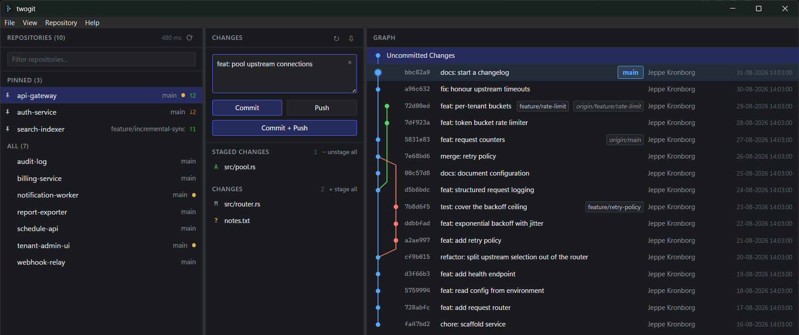

# twogit

A fast dashboard over many local git repositories. Built for the case where you have
dozens of repos in one folder, roughly five are active at a time, and you want to know at a
glance which ones need attention.

Four verbs — fetch, pull, commit, push — plus staging and branch switching. Not a general
git client. See **[SPEC.md](SPEC.md)** for the full design.



Left: the hot set pinned above everything else, each row carrying its branch, one dirty
dot and an ahead/behind badge. Middle: staged and unstaged files for the selected repo.
Right: the graph, with the *Uncommitted Changes* node on top and the HEAD commit's row
marked by a larger dot and a tint of its own lane colour.

The screenshot is taken against a throwaway folder of repositories built by
`bash scripts/make-demo-root.sh` — ahead, behind, dirty, a feature branch and one repo
with no upstream — so it can be reproduced whenever the UI moves.

**Status: build step 9 of 10.** Everything through branch switching and conflict detection
works; the polish pass is landing (pins, filter, watchers on hot repos, context menus, error
translation, the native menu bar). Multi-window, and shipping with auto-update, are what
remain.

---

## Prerequisites

| | Install |
| --- | --- |
| Node 22+ | — |
| Git 2.37+ | — |
| WebView2 runtime | — |
| Rust (stable, `x86_64-pc-windows-msvc`) | `winget install Rustlang.Rustup` |
| MSVC C++ build tools | `winget install Microsoft.VisualStudio.BuildTools --override "--quiet --wait --norestart --add Microsoft.VisualStudio.Workload.VCTools --includeRecommended"` |

Rust's default Windows toolchain links with MSVC, which is why the C++ build tools are
required even though no C++ is written here. Installing the standalone Build Tools leaves
any existing Visual Studio install untouched; adding the **Desktop development with C++**
workload to Visual Studio instead works equally well.

## Running

```sh
npm install
npm run tauri:dev      # the real app — needs Rust
```

The frontend also runs standalone in a browser, which is useful for layout work and needs
no Rust at all:

```sh
npm run dev            # http://localhost:1420
```

Outside Tauri, settings fall back to `localStorage` instead of the Rust backend, so pane
widths still persist. There is no git there, so the welcome screen says so rather than
showing an empty repo list.

## Checks

```sh
npm run check          # svelte-check + TypeScript
npm run build          # check, then production bundle
cargo test --manifest-path src-tauri/Cargo.toml
```

## Measuring

The §1 performance budget is the reason this project exists, so the measurements are
checked-in `#[ignore]`d tests rather than something to improvise later. Run them
`--release` — a debug build's numbers mean nothing.

```powershell
cd src-tauri
$env:TWOGIT_BENCH_ROOT = 'C:\dev\code'
cargo test --release --lib -- --ignored --nocapture bench_status_sweep
cargo test --release --lib -- --ignored --nocapture bench_spawn_concurrency
```

`bench_status_sweep` times discovery and the full sweep over a real folder.
`bench_spawn_concurrency` times `git --version` at increasing concurrency; it does no
repository work, so it separates "this machine creates processes slowly" from "twogit
creates them one at a time".

## Layout

```
src/
  app.css                    token layer — every colour lives here (SPEC §11)
  App.svelte                 pane grid, drag geometry, minimum widths
  lib/
    settings.svelte.ts       settings mirror; Tauri IPC or localStorage
    repos.svelte.ts          repo/status mirror; fed by the sweep event
    graph.svelte.ts          loaded commits, refs, graph selection
    graphLayout.ts           lane assignment — in-house, never `log --graph`
    gitErrors.ts             stderr → plain language (SPEC §13)
    dateFormat.ts            fixed dd-MM-yyyy HH:mm:ss, never a locale format
    menu.svelte.ts           native menu events → frontend actions
    tauri.ts                 are we running inside the desktop shell?
    Welcome.svelte           first run, missing root, or missing git
    Divider.svelte           draggable pane separator
    ContextMenu.svelte       right-click menus
    Popover.svelte           anchored overlay, used by row error badges
    GitErrorNotice.svelte    a failure plus the one action that resolves it
    EmptyState.svelte
    Mascot.svelte
    panes/
      Pane.svelte            shared header + scrolling body
      RepoList.svelte        left    — filter, pinned/all sections, sweep timing
      RepoRow.svelte         pin · name · branch · dirty dot · ahead/behind
      CommitPane.svelte      middle  — message, staging, the four verbs
      FileRow.svelte         status letter · path · stage/unstage on hover
      GraphPane.svelte       right   — virtualization, branch switching
      GraphRow.svelte        lanes · hash · subject · refs · author · date
      CommitInfoPanel.svelte commit details for the selected commit
src-tauri/
  src/
    main.rs                  desktop entry point
    lib.rs                   app state, Tauri commands, the sweeps
    settings.rs              versioned, atomically-written global settings
    roots.rs                 per-root pins and last selection
    cache.rs                 per-root status cache — a cache, never truth
    git.rs                   git resolution + the global 8-process semaphore
    writequeue.rs            one write queue per repo (SPEC §7)
    discovery.rs             depth-1 scan of a root
    status.rs                porcelain=v2 parser
    commit.rs                staging and commit
    remote.rs                fetch, pull, push, publish
    branch.rs                switching to a local or remote-tracking branch
    graph.rs                 `git log` paging and the ref badges
    watch.rs                 FS watchers on the hot set
    menu.rs                  the native Windows menu bar
scripts/
  make-icon.mjs              regenerates the placeholder icon source
  make-demo-root.sh          throwaway repos to screenshot against
```

## Notes

- **Pane widths are stored as fractions**, not pixels, so they survive window resizing.
  Minimum widths win over the stored fraction when the window is too narrow; the middle
  pane yields first, then the left.
- **Rust owns application state.** The frontend is a view. This is what keeps multi-window
  safe later — per-repo write queues and the global git semaphore are process-wide, so
  twogit runs as one process with many windows rather than many processes (SPEC §9.2).
- **Settings are advisory.** A corrupt or unreadable file resets to defaults and logs a
  warning; it never blocks startup.
- **Discovery is depth 1.** Direct children of the root only — one directory read plus an
  `exists()` per child, so it needs no progress UI (SPEC §8.1). The root itself counts too,
  so opening a single repository shows that repository rather than nothing.
- **The hot set is the FS-watch budget.** Pinned repos plus the selected one get watchers on
  `.git/HEAD`, `.git/refs` and `.git/index`; every other repo waits for the 60 s sweep. So
  pinning is a latency decision as much as a layout one, which is why it costs one click on
  the row rather than a trip through a context menu (SPEC §5.1, §6).
- **First paint never waits on git.** `open_root` returns the discovered list immediately
  and the status sweep fills the rows in afterwards, over one batched event.
- **Concurrency is capped globally at 8 git processes**, by a static semaphore in `git.rs`
  rather than by app state — the cap has to hold across every window (SPEC §7.3).
- **Read and write commands use different git binaries.** Git for Windows ships a launcher
  at `<install>\cmd\git.exe` that only execs the real binary under `mingw64\bin`; measured
  here that hop costs ~75 ms per call, more than `git status` spends working. Read-only
  commands go straight to the real binary. Anything that fetches, pulls, pushes or commits
  keeps the `git` on PATH, because inheriting credential helpers, hooks and LFS is the
  entire reason twogit shells out rather than linking libgit2 (SPEC §3).
- The repo-list header shows the **last sweep's wall clock**. The budget is 300 ms for 77
  repos (SPEC §1); a `tauri dev` build is unoptimised and will read slower than a release
  one.

### Measured on this machine, 69 repos (release build)

| | |
| --- | --- |
| Discovery, 69 repos | **5.6 ms** |
| Status sweep, best observed | **1.4 s** |
| Status sweep, frequently | **5.9 s** |
| Budget (SPEC §1) | 300 ms |

The sweep is spawn-bound, not git-bound. On this machine `cmd.exe /c ver` — a bare process
spawn doing nothing — costs **83 ms**, and `git --version` costs **88 ms** against a full
`git status` at **116 ms**. Skipping untracked files (`-uno`) saves 4 ms of 157, so the
`core.fsmonitor` remedy in SPEC §6 is aimed at a cost this machine does not have.
Concurrency is working: 8 concurrent spawns cost 221 ms, not 8 × 114 ms.

The remaining lever is therefore the **Defender/EDR exclusion** that SPEC §6 lists as a
last resort — on this evidence it belongs first.
- The icon is a placeholder. `node scripts/make-icon.mjs` regenerates the 512×512 source,
  `npm run icon` expands it into the bundled set.
